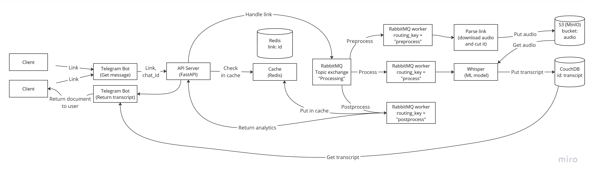

# Audio-to-text bot
This telegram bot allows users to send a link for video to [telegram bot](https://t.me/audio_to_text_tg_bot) and get a transcript and analytics on audio track.

## Project schema


**Features**:
- [FastAPI](https://fastapi.tiangolo.com/) (Python 3.10) - framework for API
- [Uvicorn](https://www.uvicorn.org/) - for ASGI web server
- [Rabbitmq](https://www.rabbitmq.com/) - message broker
- [CouchDB](https://couchdb.apache.org/) - NoSQL database to store transcripts of audio files
- [Pika](https://pika.readthedocs.io/en/stable/) - implementation of the AMQP 0-9-1 protocol for RabbitMQ
- [Pydantic-settings](https://docs.pydantic.dev/latest/usage/pydantic_settings/) - for project settings with data validation
- [Docker Compose](https://docs.docker.com/compose/) - for running application (containers for application, rabbitmq, workers and bot)
- [Pytest](https://docs.pytest.org/en/latest/) - for tests with pytest fixtures
- CI/CD pipeline: Github action for pytest and docker image build before pull request in main
- [Poetry](https://python-poetry.org/) - for packaging and dependency management
- [pytelegrambotapi](https://pypi.org/project/pyTelegramBotAPI/) - for telegram bot
- [Loguru](https://loguru.readthedocs.io/en/stable/api/logger.html) - for logging errors
- [Pre-commit](https://pre-commit.com/) - black, flake8 and isort formate code before each commit
## Getting started
You need to add secret data in src/secrets directory before building project: bot token from [BotFather](https://telegram.me/BotFather) and username and password for rabbitmq management.
Then run these commands to start project using docker.
Clone github repository
```Shell
git clone https://github.com/KatyaLubyankina/Audio-to-text-bot.git
```
Change directory to Audio-to-text-bot
```Shell
cd Audio-to-text-bot
```
```Shell
docker-compose up --build
```
You can access:
- server with FastAPI at http://localhost:8000
- documentation for FastAPI at http://localhost:8000/docs
- RabbitMQ management at http://localhost:15672
- telegram bot at https://t.me/audio_to_text_tg_bot

## Telegram bot commands
- /hello or /start - bot sends hello and explains how to use /sendlink command
- /sendlink - bot verifies link and send transcript and analytics if link was correct
## How to build project for development?
Clone github repository
```Shell
git clone https://github.com/KatyaLubyankina/Audio-to-text-bot.git
```
Change directory to Audio-to-text-bot
```Shell
cd Audio-to-text-bot
```
Start conda environment from environment_droplet.yml
```Shell
conda env create -f environment_droplet.yml
```
Activate conda environment
```Shell
conda activate condaenv
```
Add configuration for poetry
```Shell
poetry config virtualenvs.in-project false --local
poetry config virtualenvs.path <your path to anaconda>/anaconda3/envs --local
```
Install packages with poetry
```Shell
poetry install
```
Run this command to set up the git hooks scripts
```Shell
pre-commit install
```
Call pre-commit command to initialize environment for pre-commit-hooks.
```Shell
pre-commit
```

If you want to change credentials for CouchDB, specify username and password in local.ini file admin section.
